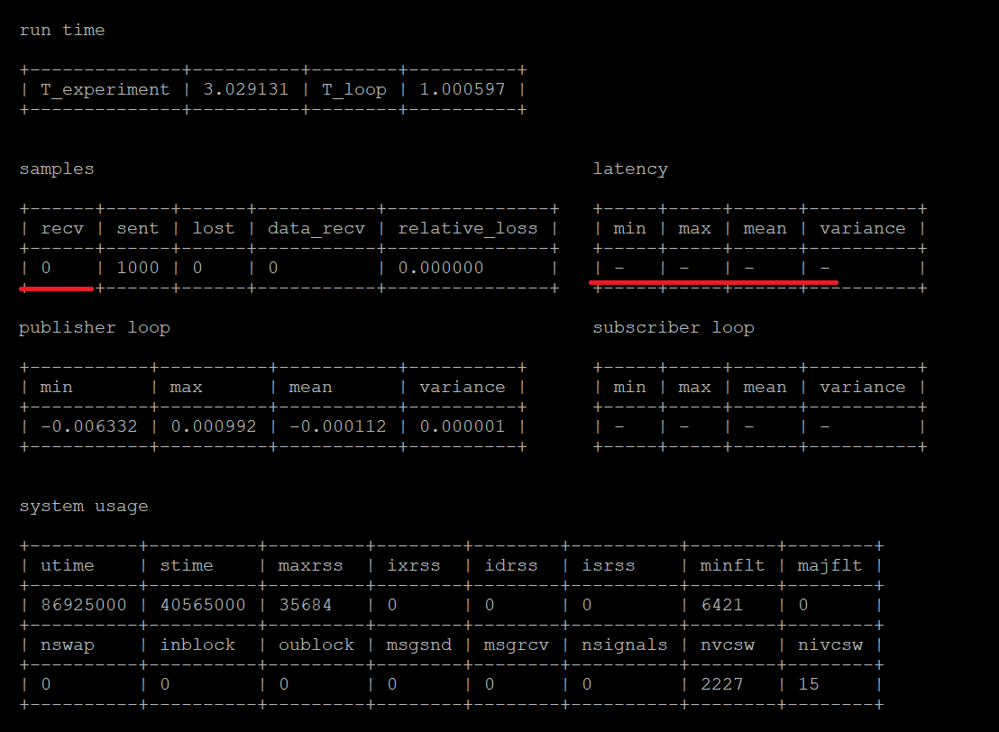
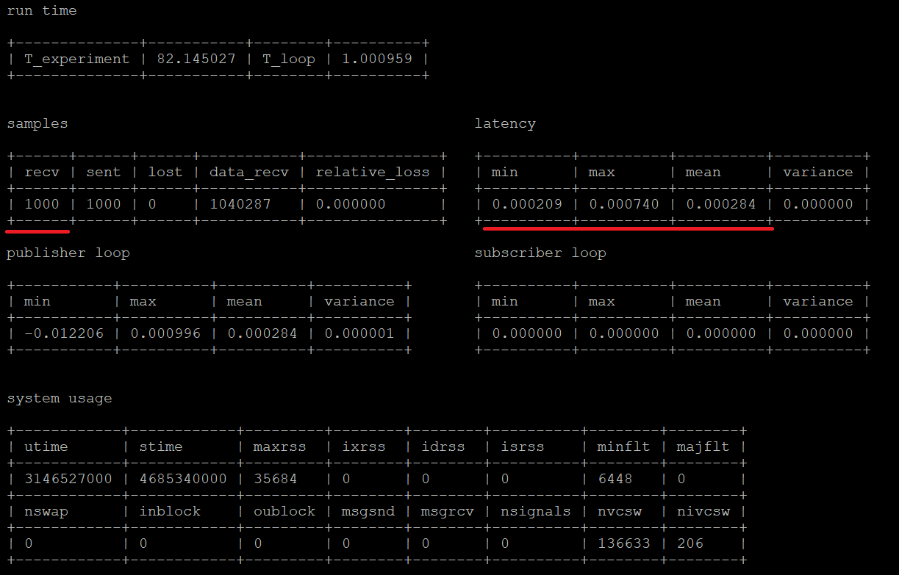

# Performance test image

## Microk8s configuration
To functions correctly the Microk8s needs to have an additional modules installed: Multus and DNS. To install them use the command below.

```shell
microk8s enable dns multus
```

The example file to run the publisher and subscriber demo is placed in this directory, in [talker_listener_demo.yaml](talker_listener_demo.yaml) file. 

## Demo explanation 

The [talker_listener_demo.yaml](talker_listener_demo.yaml) file consists of 3 parts. 

### Network Attachment Definition

In this part we configure the additional Network Interface Card (NIC) for the pods to enable the pods to send and receive multicast requests. This is crucial as it enables the applications to connect using the DDS protocol. 

The configuration in the **NetworkAttachmentDefinition** has to be adjusted to the NIC details on the machine that Microk8s instance operates. 

In the config section the `"master"` property has to be configured with the name of the NIC to be used for example:  `"master": "enp0s3"`

Additionally the subnet has to be configured in the `"ranges"` node. The correct nodes configuration has to be set for the `subnet`, `rangeStart`, `rangeEnd` and `gateway` the set properties have to be compatible with the network settings your machine is running on.

The example configuration is shown below:
```json   
    "ranges": [
        [ {
            "subnet": "10.0.2.0/24",
            "rangeStart": "10.0.2.1",
            "rangeEnd": "10.0.2.254",
            "gateway": "10.0.2.255"
        } ]
    ]
```    

### Talker and Listener deployments

The talker and listener deployments specifies the configuration that will be used in the demo application. 

There are 2 parts of the configuration for each of the deployments correctly work in the demo. 

#### Annotations

The annotations are the way to configure the additional NIC for the pods and the deployments. We have to place the annotation info in the Deployment metadata node as well as in the Template metadata. It will result in the following configuration for the listener deployment:
```yaml
apiVersion: apps/v1
kind: Deployment
metadata:
name: ros-listener-deployment
labels:
    app: ros-listener
annotations:
    k8s.v1.cni.cncf.io/networks: dds-network
spec:
replicas: 1
selector:
    matchLabels:
    app: ros-listener
template:
    metadata:
    labels:
        app: ros-listener
    annotations:
        k8s.v1.cni.cncf.io/networks: dds-network
---
```

#### Container command

To run the container correctly the command has to be configured. The command is that keeps the container alive. After the command finishes, the container ends its lifespan. For both the talker and a listener the separate commands have to be specified. 

In the `command` node of the yaml file we specify that the command will use the shell to be run. The configuration is shown in the below example as `command: ["/bin/bash", "-c"]`. It tells the container to execute `bash` command and give it parameters. The parameters are what actually will be executed by the container. 

The parameters are defined in the `args` node. 
To enable the easy access to the ROS commands, the correct `setup.bash` file has to be sourced first. Next, we run a command to start the demo program of the talker and the listener. The example below showcases the command or the listener. For the talker, the `listener` word has to be changed for `talker`. 
```yaml
    spec:
      containers:
      - name: listener
        image: public.ecr.aws/c8q3f0b5/ros-performance-test:latest 
        command: ["/bin/bash", "-c"]
        args: ["source /opt/ros/foxy/setup.bash && ros2 run demo_nodes_cpp listener"]
        imagePullPolicy: IfNotPresent

```

The whole configuration is presented in the [talker_listener_demo.yaml](talker_listener_demo.yaml) file.

## Deploymnet 

To deploy the demo application use the following command with the Microk8s:

```shell
microk8s.kubectl apply -f /path/to/the/talker_listener_demo.yaml
```

The command will provision the new `NetworkAttachmentDefinition` and will create the deployments for the talker and a listener. 
## Demo validation 

### Deployment validation
To validate that the application is working correctly use the command to list the resources provisioned by the Microk8s.

```shell
microk8s.kubectl get all
```
The command should output the 2 pods in the first section, the kubernetes service, 2 deployments for the talker and listener and 2 replica sets associated with the deployments.

The pods should have the `Runnig` status. If it is the first time that these commands are being run bear in mind that the container may take a while to start as the image required has a big size (about 3.5GB when downloaded). While the image is being downloaded, the pods will show `ContainerCreating` status.

### Application validation
To validate that the both applications are working correctly use the following commands to check the outputs of each pod.

```shell
microk8s.kubectl logs --follow -l app=ros-talker
```

This command will print any text to your terminal that is outputted by the ros-talker pod. You should see the similar outputs:

```
[INFO] [1642153319.274536973] [talker]: Publishing: 'Hello World: 1779'
[INFO] [1642153320.276232763] [talker]: Publishing: 'Hello World: 1780'
[INFO] [1642153321.275711637] [talker]: Publishing: 'Hello World: 1781'
[INFO] [1642153322.274403688] [talker]: Publishing: 'Hello World: 1782'
[INFO] [1642153323.274761271] [talker]: Publishing: 'Hello World: 1783'
```

The listener pod is checked in the same way. We specify the command to follow logs in the listener pod.
```shell
microk8s.kubectl logs --follow -l app=ros-listener
```

The output should look like following:

```
[INFO] [1642153312.274727564] [listener]: I heard: [Hello World: 1772]
[INFO] [1642153313.274628685] [listener]: I heard: [Hello World: 1773]
[INFO] [1642153314.274828568] [listener]: I heard: [Hello World: 1774]
[INFO] [1642153315.274757853] [listener]: I heard: [Hello World: 1775]
[INFO] [1642153316.276216368] [listener]: I heard: [Hello World: 1776]
```

If the both commands have outputted the text similar to the shown it means that the demo application is working correctly in the Kubernetes environment.
## Running demo with the performance tests

Retrieve the name of the talker pod and listener pod via the command:
```
microk8s.kubectl get pod
```

Login to the talker pod using:
```shell
microk8s.kubectl exec --stdin --tty  name-of-ros-talker-pod      
```
run the performance test in the talker pod as:
```
/opt/performance_test/lib/performance_test/perf_test -c FastRTPS --msg Array1k --roundtrip-mode Main
```
Figure below shows the latency of the past 1000 messages (each message is 1K in size). The performance test had not been switched on in the listener yet . There are 0 messages received as highlighted in the screenshot.



Open a new terminal, login to the listener using:
```shell
microk8s.kubectl exec --stdin --tty  name-of-ros-listener-pod      
```
run the listener in the relay mode as:
```shell
/opt/performance_test/lib/performance_test/perf_test -c FastRTPS --msg Array1k --roundtrip-mode Relay
```

As shown in the picture below, the received messages in the talker pod are updated immediately. There is no package lost in this test. The latency is less than 1 ms.


