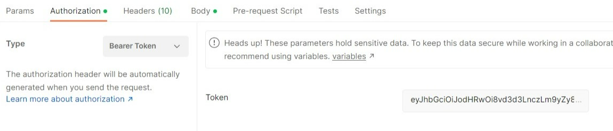

# 1) Onboard a new user to the Middleware system:

In this section, we will learn how to onboard a new user to the Middleware system. The steps are mentioned below:

## Step 1:  Configuration of the preferred REST API Client


As part of the configuration of the preferred REST API client like `Postman` or `Insomnia` the following properties have to be set for the registration process

* The IP address of the Middleware
* Path of a request `request/Register`
* Request method is set to `POST`
* `Content-Type` header value set to `application/json`


## Step 2: Registration to the Middleware 

To create a new user in the Middleware system, the user needs to be registered with a username, password, and role. In the body section of the request, the registration credentials have to be provided.

* Provide registration credentials using json format
* Tick the raw button
* Select JSON from the dropdown menu
* Click the Send button


The full User import template looks like the following: 

```
{
    "UserName": "TestAdmin",
    "Password": "Testpassword"
    "Role":"admin"
}
```

## Step 3: Login to the Middleware

To login to the Middleware the user has to adjust the following changes for the call
* Request method is set to `POST`
* The IP address of the Middleware
* Path for the `request /Login`
* The body of the request should contain the `username` and `password`


Once the user makes the request for the login, the response body will contain a JWT token which will have to be attached to the calls in order to access the endpoints of the Middleware.


## Step 4: Using the JWT token for accessing the Middleware

For attaching the JWT token when making a call to one of the endpoints of the Middleware, the user has to do the following.
* Provide the path for to the endpoint
* Select the `Authorization` section
* Choose `Bearer Token` from the dropdown menu
* Paste the `token` in the token section and make the call by clicking `Send` button




