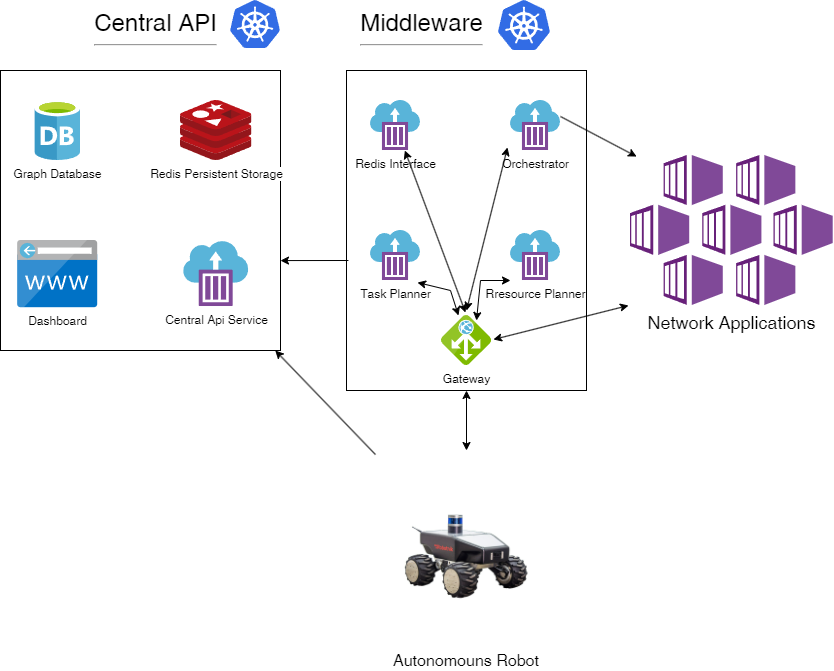

# Middleware architecture

This document describes the architecture used by the Middleware. How it interacts with other system components and backing resources needed like databases or platforms it is designed to run on. 

## Infrastructure provision

Currently the required infrastructure to deploy 5G-ERA Middleware can be deployed under the AWS private cloud using the dedicated Terraform module. More information about how to run the module and what it deploys can be found in teh [middleware repository](https://github.com/5G-ERA/middleware/tree/main/terraform/AWS).