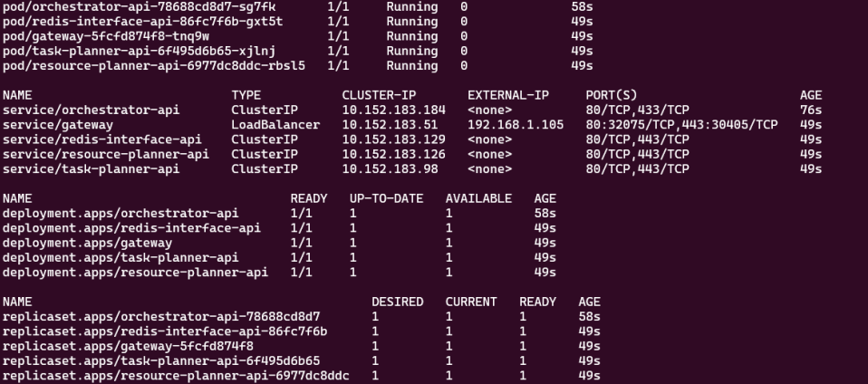

# Middleware deployment

There are two ways of deploying the Middleware. They are used in different scenarios:
1. When you connect to existing Middleware infrastructure, you use deployment with AWS Secrets Manager
2. When you're deploying on new infrastructure without Secrets Manager, look for manual deployment


For the detailed configuration explanation visit [configuration guide](../../configuration/readme.md).
### Configuration with AWS Secrets Manager

When using AWS Secrets Manager, the Middleware requires minimal configuration which consists of specifying the following variables:

1. Middleware__Organization – the organization to which this middleware belongs. The organization is an artificial group of Middlewares that can cooperate.
2. Middleware__InstanceName – a **unique** name of the Middleware.
3. Middleware__InstanceType – Either Edge/Cloud.
4. Middleware__Address - The entry point for the middleware is usually the gateway address ex: 10.10.18.17:80 
5. CENTRAL_API_HOSTNAME - Address of the CentralAPI that is responsible for authenticating the Middleware instances during the startup. For more information refer to the [CentralAPI documentation](CentralApi).
6. AWS_ACCESS_KEY_ID - Aws access key ID used to access the services in AWS like Secret Manager.
7. AWS_SECRET_ACCESS_KEY - Aws secret used to authenticate the access key.

In the [orchestrator.yaml](https://github.com/5G-ERA/middleware/tree/main/k8s/orchestrator/orchestrator.yaml) file, remove commented lines that are required only for the deployment without Secrets Manager.

### *Manual deployment*

The last step is to prepare the deployment script for the middleware. It can be found [here](https://github.com/5G-ERA/middleware/tree/main/k8s/orchestrator/orchestrator.yaml). In the `orchestrator.yaml` file there are environment variables that must be set to ensure the correct work of the Orchestrator. 


The required variables are:

1. Middleware__Organization – the organization to which this middleware belongs. The organization is an artificial group of Middlewares that can cooperate.
2. Middleware__InstanceName – a **unique** name of the Middleware.
3. Middleware__InstanceType – Either Edge/Cloud.
4. Middleware__Address - The entry point for the middleware is usually the gateway address ex: 10.10.18.17:80 
5. CustomLogger__LoggerName - Either Loki/Elasticsearch.
6. CustomLogger__Url - The url of the logger.
7. CustomLogger__User - The username for the logger.
8. CustomLogger__Password - The password for the logger.
9. Slice__Hostname - The hostname of the SliceManager API that allows integration of the 5G slices into the planning process of the Middleware.
10. RabbitMQ__Address - The address of RabbitMQ. 
11. RabbitMQ__User - The user for RabbitMQ. 
12. RabbitMQ__Pass - The password for RabbitMQ.
13. CENTRAL_API_HOSTNAME - Address of the CentralAPI that is responsible for authenticating the Middleware instances during the startup. For more information refer to the [CentralAPI documentation](CentralApi).
14. AWS_ACCESS_KEY_ID - Aws access key ID used to access the services in AWS like Secret Manager.
15. AWS_SECRET_ACCESS_KEY - Aws secret used to authenticate the access key.
16. Redis__ClusterHostname - The address of the redis backend.
17. Redis__Password - The password for the redis backend.
18. InfluxDB__Address - Address to which connect to InfluxDB, includes protocol, address, and port
19. InfluxDB__ApiKey - Api key to access InfluxDB

## Middleware version
The most up-to-date Middleware version is `v1.0.0`. Remember to set this tag in the `orchestrator.yaml` file in the `spec -> template -> spec -> containers -> image`. 


## Middleware deployment 

After all the values are set, the Middleware can be deployed. Start with the deployment of the Orchestrator:

```shell
kubectl apply -f orchestrator.yaml -n middleware
```

Alternatively, you can use utility scripts located at [k8s/orchestrator](https://github.com/5G-ERA/middleware/tree/main/k8s/orchestrator):

```shell
./deploy.sh
```

The containers will be downloaded, and the Orchestrator will deploy the rest of the Middleware deployments and services required. 

### Deployment Verification

To check and monitor the status of the deployment of the Middleware services use the following
command:

```shell
watch -c kubectl get all -n middleware
```

It will monitor the status of all the services deployed in the middleware namespace.

The following objects should be deployed:

1. Orchestrator
2. Gateway
3. Redis interface
4. Resource planner
5. Task planner

Each of these services is represented by the pod, service, deployment and replica set in the Kubernetes environment. With the deployment of the Orchestrator, the other services are deployed automatically. The process of their deployment may take a while depending on the internet connection that the machine has. 

If only the Orchestrator is visible with the status of the pod as Container Creating, it needs additional time to download the application. After the deployment of the Orchestrator, soon the other components should begin their deployment. The result should look like the image below.

<p align="left">
    
</p>

If there are errors during the deployment of the orchestrator, then check if you correctly configured access to the AWS registry and access keys.

In case there are any errors during the deployment of the Gateway and Redis interface, check if the firewall does not block access to the Redis server.

After the deployment is complete the gateway should be accessible through the IP address specified in the EXTERNAL-PI column. In case the IP address is not working use the following command to redirect the traffic from the specified port on the localhost to the gateway:

```shell
kubectl port-forward -n middleware service/gateway 5000:80
```

This command will port forward the traffic from port 5000 to port 80 in the service. The middleware will be now accessible under the following address:

```
http://localhost:5000/
```
---

