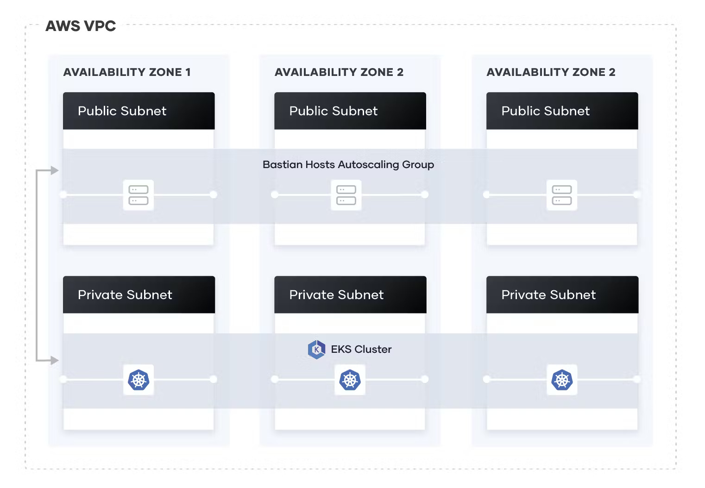

# Infrastructure installation

## Cloud Installation
Middleware requires the provision of the specific Cloud infrastructure to enable resiliency of the deployment. 
Because of this, the complex infrastructure is required, as the one presented below.



Manual provision of the given infrastructure is complicated and time-consuming. 
This is why the dedicated Terraform script has been created.

The script to deploy the Cloud infrastructure in AWS public cloud is located in [AWS folder](AWS/README.md). 
Follow the guide over there to deploy the infrastructure and learn more details about deployed components.

## Edge Installation

Edge Installation is not as complicated as the Cloud deployment, which is why the direct tutorial is given.
### Prerequisites

This Middleware installation tutorial assumes the Middleware is installed in the `Ubuntu` system with version `20.04` or newer.

The recommended hardware specifications for running the Middleware locally for testing purposes are:

* CPU - 4 cores
* RAM - 16 GB or above
* Memory - 100 GB or more

For the production environment, the hardware specifications will differ as the minimum requirements will be based on the number of Network Applications the Middleware will be running. The more Network Applications, the more hardware resources will be needed.

### Troubleshooting

In case of problems with the installation or deployment please see the [Possible Errors](#possible-errors) section at the bottom of the document.

If you find any problems during the **deployment** of the Middleware, feel free to open a new [issue](https://github.com/5G-ERA/middleware/issues/new/choose).

---

### Machine configuration

#### 1) Install Kubectl

The Kubectl is the command-line tool that allows communication and management of the Kubernetes cluster. To install it use the preferred way on the [official guide](https://kubernetes.io/docs/tasks/tools/install-kubectl-linux/).

Afterward, if the `~/.kube` folder was not created:

```shell
mkdir -p ~/.kube
```

#### 2) Install Microk8s

Microk8s is the minimal Kubernetes installation that can be used on the local computer. It will be used to run the Middleware.

Although this guide provides installation instructions for the `microk8s`, any Kubernetes distribution like `minikube` or `kind` can be used. The installation instructions will differ and some configuration parts may differ in case of the deployment in a public cloud environment like AWS EKS or Azure AKS.


`microk8s` can be installed with the following command:

```shell
sudo snap install microk8s --classic
```

After the installation is complete `microk8s` needs access to the `~/.kube` folder so we give it the permissions and we add the current user to the `microk8s` group, so we can use the commands without `sudo`.

```shell
sudo usermod -a -G microk8s $USER
sudo chown -f -R $USER ~/.kube
```

After the installation is finished copy the configuration file of the `microk8s` to the `.kube/config` file for the `kubectl` command to be able to access the microk8s cluster.

```shell
sudo microk8s config > ~/.kube/config
```

Afterward, validate the connection to the cluster with the command

```shell
kubectl get all -n kube-system
```

With the `kubectl` access to the cluster, the additional modules have to be installed to ensure the correct work of the Middleware.

We enable `metallb` addon to enable communication with the services inside the cluster with the dedicated IP address. During the execution of this command, **you will be asked to provide the ranges of the IP addresses you wish to use** for exposing services behind a Load Balancer.
```shell
 sudo microk8s enable metallb
```

The DNS module is responsible for routing the DNS-based requests to be routed to the correct pods and services

```shell
 sudo microk8s enable dns
```

In the end, we enable ingress as a backup for exposing the services from the cluster.

```shell
 sudo microk8s enable ingress
```

With all the necessary programs and addons installed, we can proceed to configure the cluster itself.

## Cluster configuration

After the `microk8s` is installed and the `kubectl` command has access to the cluster, it is time to configure the cluster so the middleware can be deployed and function correctly inside of it.

The files required for the execution of the cluster configuration are provided [here](https://github.com/5G-ERA/middleware/tree/main/k8s/cluster-config).


**Note: To execute the provided commands, make sure you are in the same directory as the downloaded files.**

For organization and segregation purposes Middleware works in a separate Kubernetes namespace. We create a new *namespace* with the following command:

```shell
kubectl create namespace middleware
```

For this purpose, the Service Account with the correct permissions is needed. The Service Account will give the necessary permissions to the Middleware for accessing the Kubernetes API and managing the
resources as a part of its functionality.


To do so, use the command:
```shell
kubectl apply -f orchestrator_service_account.yaml 
```

The next step is to create the Role, which specifies the permissions needed for the proper functioning of the Middleware. The `role` specifies the permissions to get, watch, list create and delete resources in the Middleware namespace. It affects the pods, services, deployments, namespaces, and replica sets in the cluster. To create the `Role`, use the following command:

```shell
kubectl apply -f orchestrator_role.yaml 
```

The last step to configuring the Kubernetes cluster is to bind the Cluster Role to the Service Account.

For this `Role Binding` is necessary. To create it, use the following command:

```shell
kubectl apply -f orchestrator_role_binding.yaml
```

## Possible errors:

### 1) Error installing microk8s:

In this case, there are problems with installing the `microk8s` like in the image below during the exexution of the command

```shell
sudo snap install microk8s --classic
```

<p align="left">
    
</p>


Then `snapd` package in the system must be updated. You can do it with the following commands:

```shell
sudo apt update
sudo apt upgrade snapd
```
