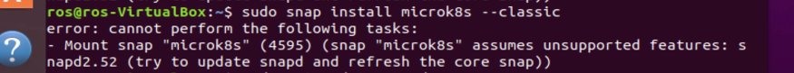

# Middleware installation guide:

Last time revised: 18/04/2023

---

## Prerequisites

This Middleware installation tutorial assumes the Middleware is installed in the `Ubuntu` system with version `20.04` or newer.

The recommended hardware specifications for running the Middleware locally for testing purposes are:

* CPU - 4 cores
* RAM - 16 GB or above
* Memory - 100 GB or more

For the production environment, the hardware specifications will differ as the minimum requirements will be based on the number of Network Applications the Middleware will be running. The more Network Applications the more hardware resources will be needed.

## Troubleshooting

In case of problems with the installation or deployment please see the [Possible Errors](#possible-errors) section at the bottom of the document. 

If you will find any problems during the **deployment** of the Middleware, feel free to open a new [issue](https://github.com/5G-ERA/middleware/issues/new/choose).

---

## Machine configuration

### 1) Install Kubectl

The Kubectl is the command-line tool that allows communication and management of the Kubernetes cluster. To install it use the preferred way on the [official guide](https://kubernetes.io/docs/tasks/tools/install-kubectl-linux/).

Afterward, if the `~/.kube` folder was not created:

```shell
mkdir -p ~/.kube
```

### 2) Install Microk8s

Microk8s is the minimal Kubernetes installation that can be used on the local computer. It will be used to run the Middleware. 

Although this guide provides installation instructions for the `microk8s`, any Kubernetes distribution like `minikube` or `kind` can be used. The installation instructions will differ and some configuration parts may differ in case of the deployment in a public cloud environment like AWS EKS or Azure AKS.


`microk8s` can be installed with the following command:

```shell
sudo snap install microk8s --classic
```

After the installation is complete `microk8s` needs access to the `~/.kube` folder so we give it the permissions and we add the current user to the `microk8s` group, so we can use the commands without `sudo`.

```shell
sudo usermod -a -G microk8s $USER
sudo chown -f -R $USER ~/.kube
```

After the installation is finished copy the configuration file of the `microk8s` to the `.kube/config` file for the `kubectl` command to be able to access the microk8s cluster. 

```shell
sudo microk8s config > ~/.kube/config
```

Afterward, validate the connection to the cluster with the command

```shell
kubectl get all -n kube-system
```

With the `kubectl` access to the cluster, the additional modules have to be installed to ensure the correct work of the Middleware.

We enable `metallb` addon to enable communication with the services inside the cluster with the dedicated IP address. During the execution of this command, **you will be asked to provide the ranges of the IP addresses you wish to use** for exposing services behind a Load Balancer.
```shell
 sudo microk8s enable metallb
```

The DNS module is responsible for routing the DNS-based requests to be routed to the correct pods and services

```shell
 sudo microk8s enable dns
```

In the end, we enable ingress as a backup for exposing the services from the cluster. 

```shell
 sudo microk8s enable ingress
```

With all the necessary programs and addons installed, we can proceed to configure the cluster itself.

---

## Cluster configuration

After the `microk8s` is installed and the `kubectl` command has access to the cluster, it is time to configure the cluster so the middleware can be deployed and function correctly inside of it.

The files required for the execution of the cluster configuration are provided [here](https://github.com/5G-ERA/middleware/tree/main/k8s/cluster-config).


**Note: To execute the provided commands, make sure you are in the same directory as the downloaded files.**

For organization and segregation purposes Middleware works in a separate Kubernetes namespace. We create a new *namespace* with the following command: 

```shell
kubectl create namespace middleware
```

For this purpose, the Service Account with the correct permissions is needed. The Service Account will give the necessary permissions to the Middleware for accessing the Kubernetes API and managing the
resources as a part of its functionality.


To do so, use the command:
```shell
kubectl apply -f orchestrator_service_account.yaml 
```

The next step is to create the Role, which specifies the permissions needed for the proper functioning of the Middleware. The `role` specifies the permissions to get, watch, list create and delete resources in the Middleware namespace. It affects the pods, services, deployments, namespaces, and replica sets in the cluster. To create the `Role`, use the following command:

```shell
kubectl apply -f orchestrator_role.yaml 
```

The last step to configuring the Kubernetes cluster is to bind the Cluster Role to the Service Account.

For this `Role Binding` is necessary. To create it, use the following command:

```shell
kubectl apply -f orchestrator_role_binding.yaml
```

---

## Middleware deployment
There are two ways of deploying the Middleware. They are used in different scenarios:
1. When you connect to existing Middleware infrastructure, you use deployment with AWS Secrets Manager
2. When you're deploying on new infrastructure without Secrets Manager, look for manual deployment

### Configuration with AWS Secrets Manager

When using AWS Secrets Manager, the Middleware requires minimal configuration which consists of specifying the following variables:

1. IMAGE_REGISTRY – contains the address of the registry in which the Middleware images are stored. By default this value is `ghcr.io/5g-era`
2. Middleware__Organization – the organization to which this middleware belongs. The organization is an artificial group of Middlewares that can cooperate.
3. Middleware__InstanceName – a **unique** name of the Middleware.
4. Middleware__InstanceType – Either Edge/Cloud.
5. Middleware__Address - The entry point for the middleware is usually the gateway address ex: 10.10.18.17:80 
6. CENTRAL_API_HOSTNAME - Address of the CentralAPI that is responsible for authenticating the Middleware instances during the startup. For more information refer to the [CentralAPI documentation](CentralApi).
7. AWS_ACCESS_KEY_ID - Aws access key ID used to access the services in AWS like Secret Manager.
8. AWS_SECRET_ACCESS_KEY - Aws secret used to authenticate the access key.

In the [orchestrator.yaml](https://github.com/5G-ERA/middleware/tree/main/k8s/orchestrator/orchestrator.yaml) file, remove commented lines that are required only for the deployment without Secrets Manager.

### Manual Configuration

The last step is to prepare the deployment script for the middleware. It can be found [here](https://github.com/5G-ERA/middleware/tree/main/k8s/orchestrator/orchestrator.yaml). In the `orchestrator.yaml` file there are environment variables that must be set to ensure the correct work of the Orchestrator. 


The required variables are:

1. IMAGE_REGISTRY – contains the address of the registry in which the Middleware images are stored. By default this value is `ghcr.io/5g-era`
2. Middleware__Organization – the organization to which this middleware belongs. The organization is an artificial group of Middlewares that can cooperate.
3. Middleware__InstanceName – a **unique** name of the Middleware.
4. Middleware__InstanceType – Either Edge/Cloud.
5. Middleware__Address - The entry point for the middleware is usually the gateway address ex: 10.10.18.17:80 
6. CustomLogger__LoggerName - Either Loki/Elasticsearch.
7. CustomLogger__Url - The url of the logger.
8. CustomLogger__User - The username for the logger.
9. CustomLogger__Password - The password for the logger.
10. Slice__Hostname - The hostname of the SliceManager API that allows integration of the 5G slices into the planning process of the Middleware.
11. RabbitMQ__Address - The address of RabbitMQ. 
12. RabbitMQ__User - The user for RabbitMQ. 
13. RabbitMQ__Pass - The password for RabbitMQ.
14. CENTRAL_API_HOSTNAME - Address of the CentralAPI that is responsible for authenticating the Middleware instances during the startup. For more information refer to the [CentralAPI documentation](CentralApi).
15. AWS_ACCESS_KEY_ID - Aws access key ID used to access the services in AWS like Secret Manager.
16. AWS_SECRET_ACCESS_KEY - Aws secret used to authenticate the access key.
17. Redis__ClusterHostname - The address of the redis backend.
18. Redis__Password - The password for the redis backend.
19. InfluxDB__Address - Address to which connect to InfluxDB, includes protocol, address, and port
20. InfluxDB__ApiKey - Api key to access InfluxDB

## Middleware version
The most up-to-date Middleware version is `v0.10.0`. Remember to set this tag in the `orchestrator.yaml` file in the `spec -> template -> spec -> containers -> image`. 

Until the Middleware releases version `1.0`, we recommend using the `latest` tag, as it is not guaranteed to provide backward compatibility. From versions `1.0` and later, backward compatibility will be ensured.

## Middleware deployment 

After all the values are set, the Middleware can be deployed. Start with the deployment of the Orchestrator:

```shell
kubectl apply -f orchestrator.yaml -n middleware
```

Alternatively, you can use utility scripts located at [k8s/orchestrator](https://github.com/5G-ERA/middleware/tree/main/k8s/orchestrator):

```shell
./deploy.sh
```

The containers will be downloaded, and the Orchestrator will deploy the rest of the Middleware deployments and services required. 

### Deployment Verification

To check and monitor the status of the deployment of the Middleware services use the following
command:

```shell
watch -c kubectl get all -n middleware
```

It will monitor the status of all the services deployed in the middleware namespace.

The following objects should be deployed:

1. Orchestrator
2. Gateway
3. Redis interface
4. Resource planner
5. Task planner

Each of these services is represented by the pod, service, deployment and replica set in the Kubernetes environment. With the deployment of the Orchestrator, the other services are deployed automatically. The process of their deployment may take a while depending on the internet connection that the machine has. 

If only the Orchestrator is visible with the status of the pod as Container Creating, it needs additional time to download the application. After the deployment of the Orchestrator, soon the other components should begin their deployment. The result should look like the image below.

<p align="left">
    
</p>

If there are errors during the deployment of the orchestrator, then check if you correctly configured access to the AWS registry and access keys.

In case there are any errors during the deployment of the Gateway and Redis interface, check if the firewall does not block access to the Redis server.

After the deployment is complete the gateway should be accessible through the IP address specified in the EXTERNAL-PI column. In case the IP address is not working use the following command to redirect the traffic from the specified port on the localhost to the gateway:

```shell
kubectl port-forward -n middleware service/gateway 5000:80
```

This command will port forward the traffic from port 5000 to port 80 in the service. The middleware will be now accessible under the following address:

```
http://localhost:5000/
```
---

## Possible errors:

### 1) Error installing microk8s: 

In this case, there are problems with installing the `microk8s` like in the image below during the exexution of the command

```shell
sudo snap install microk8s --classic
```

<p align="left">
    
</p>


Then `snapd` package in the system must be updated. You can do it with the following commands:

```shell
sudo apt update
sudo apt upgrade snapd
```
