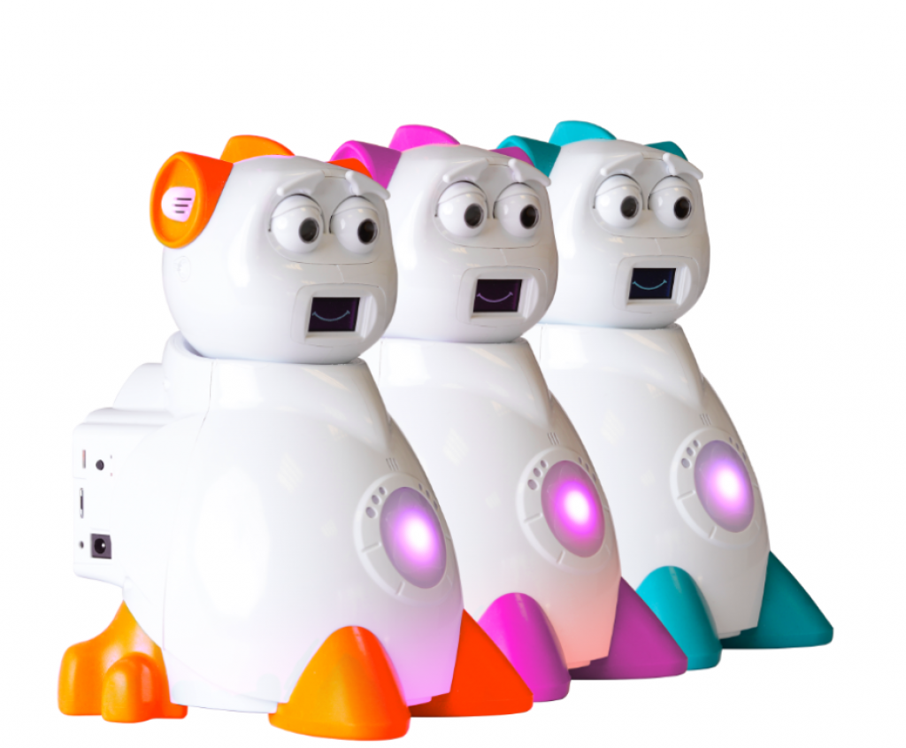
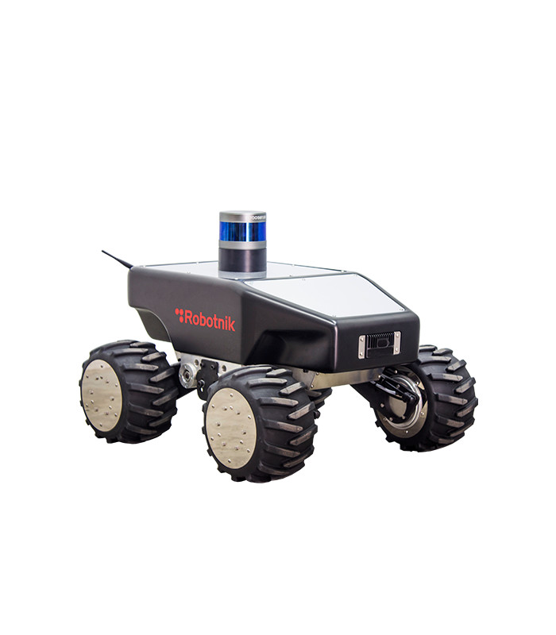

## Example of onboarding files for various robots.

At the moment, these are the available pre-defined onboarding files for robots that we have tested in the 5G-ERA project. We plan to extend this list in the future. Please, look at our roadmap for further details.

1) [Aisoy Kik](Aisoy_OnboardingV2.json) - From Aisoy Robotics  

  

2) [Kobuki Base](Kobuki.json) - Yujin Robot

  

3) [Summit XL](summit_xl_onboaring.json) - From RobotNik

