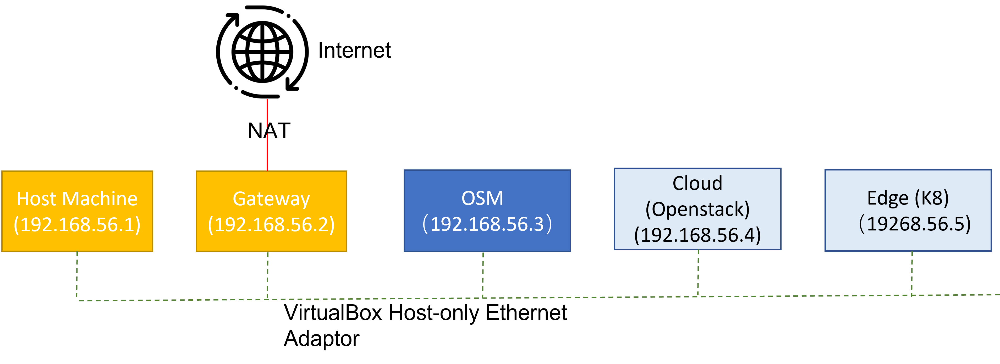
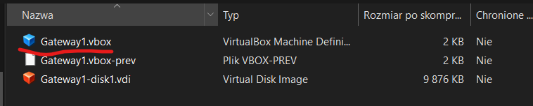
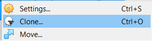
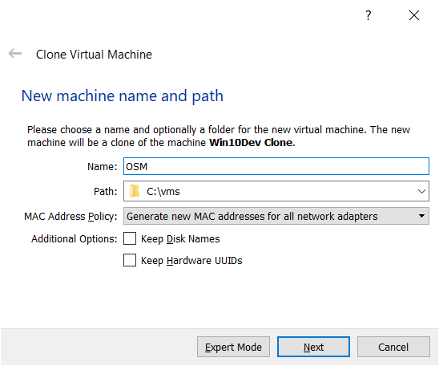
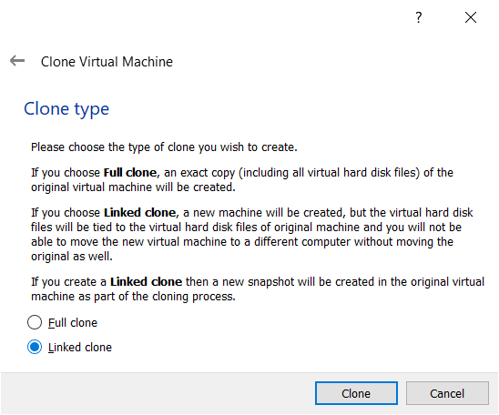
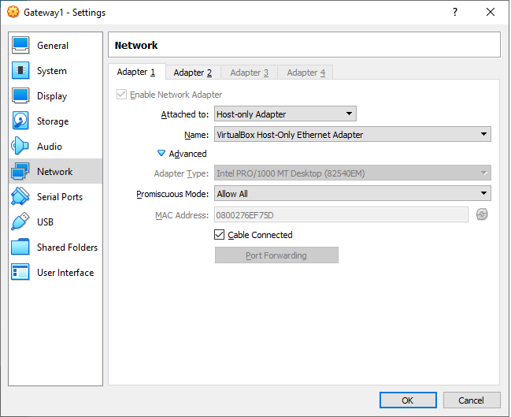
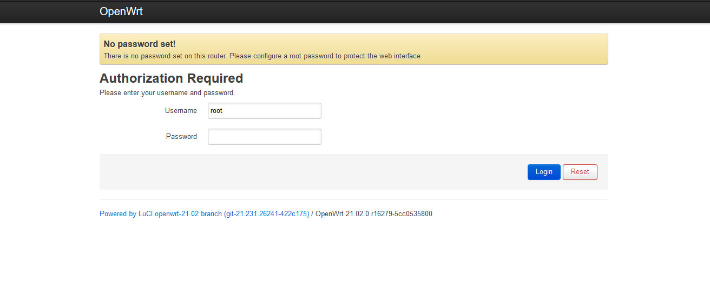

# OSM installation and configuration for DEV environment

This document presents the process of creating the testing environment for the OSM that is used to orchestrate the cloud resources in the [5G-ERA](https://www.5g-era.eu/) project.
The presented document explains the architecture for the testing environment and the process of setting it up.
The process of configuring the local testing environment takes around 2 hours.

## Architecture overview
For the correct work, the system is distributed across three different Virtual Machines and a gateway. The machines are connected between each other using the gateway, that has the access to the internet. All the machines can be accessed from the hist machine, as it is a part of the network. The Diagram below showcases the network architecture between the VMs. 



## Virtual Machines preparation
The machines can be downloaded from the following links:
* [Gateway](https://shared-assets.adobe.com/link/369df8b5-8c43-48f2-4e21-d95a25d7123c)
* [Ubuntu base image](https://shared-assets.adobe.com/link/6678b65f-f541-4308-73bc-292b5a22d981)

When downloaded extract each image and open the file with .vbox extension.


Double click the *Gateway1.vbox* to open the Virtual machine configuration using the Virtual Box. It will add the new Virtual Machine. 

Repeat the above steps with the Ubuntu base image.

### Ubuntu image multiplication

After the Ubuntu image is extracted and imported to the VirtualBox it has to be cloned, to be used as a base for the 3 additional Virtual Machines.

To clone the VM, right click on the VM and click *Clone* button. 


Specify the details for the new VM. New name, path in which the machine will be stored and if the clone operation should generate new MAC addresses for the network interfaces. It is recommended to generate a new MAC addresses for each of the network interfaces. 


In the next step the clone type should be specified. The full clone will create new independent resources, while linked clone will share the base resources with the machine that we create the clone of. It is recommended if we want to save the disk space for the images.

After this step, VirtualBox should start the process of creating a new Virtual Machine.

After the clone has finished, the steps have to be repeated for another 2 machines, which we will name **Openstack** and **Edge**.

## Virtual Machine system resource requirements
The OSM testing package is very resource demanding. The recommended requirements below are presented separately for the gateway and for other machines. 

### Gateway recommended system requirements

The recommended system requirements present as following:
* Processors: 1
* RAM: 256MB

The gateway needs to have configured 2 network cards. The first one is attached to the **Host-Only Adapter**, for the correct work it needs to have **Promiscuous Mode set to Allow All**. 

The second card is enables and has to be attached to NAT to be used as an internet access network card. 

### OSM, OpenStack and Edge VMs

The recommended system requirements for both  present as following:
* Processors: 2
* RAM: 6GB

To set the system specification, go to the *System* tab in the Virtual Machine settings.

The machines need to have configured only 1 network card. This card has to be attached to **Host-only Adapter** with a **Promiscuous Mode set to Allow All**.


## Virtual Machines configuration

### Gateway configuration

The gateway should come pre-configured and ready to use. After the machine starts, it should be accessible under `192.168.56.2` address in the browser.


The password for the root user is the same as username.

### Configuration of other machines
The OSM, Microstack and Edge machines will have to be configured separately, one after another, because by default they will hare the same IP address of `192.168.56.5`. The process of configuration will focus on setting up the unique IP address and unique name for the machine in the local network. The addresses will be set the same as on the [Architecture overview](#architecture-overview).

On the example of the OSM machine its name will be changed and the IP address set. 
#### Login to the machine
There are 2 ways of setting up the machine. It can be done directly using the VM window displayed by the Virtual Box or using the SSH when the machine has been launched in the head-less mode. 
To login to the machine with SSH, the ssh client is needed. On the Windows machine this can be done with the PuTTY, GitBash or WSL. Unix machines have SSh built-in.

To connect to the machine use the following command.

```shell 
$ ssh ros@192.168.56.5
```
It will open the SSH tunnel to the virtual machine. 

The password is the same as the username and can be changed later on.

#### Set IP address
At first we set up the IP address for the virtual machine. To do this, the netplan configuration has to be changed. 
Open the file below, use the preferred terminal text editor.
```shell
$ sudo vim /etc/netplan/00-installer-config.yaml
```
Modify the file to have the following look.
```yaml
# This is the network config written by 'subiquity'
network:
  ethernets:
    enp0s3:
      addresses:
      - 192.168.56.3/24
      gateway4: 192.168.56.2
      nameservers:
        addresses:
        - 192.168.56.2
        - 192.168.56.2
        search: []
  version: 2
```
In this file the IP address to `192.168.56.3` according to the specification described earlier. Also note the `gateway4` and `addresses` fields that point to the address of the gateway machine.

#### Change the name of the machine
To change the name of the machine the 2 files have to be modified first one is `hosts` file, and other is the `hostname` file.
Start with the `hostname` file, open it with the preferred editor.
```shell
$ sudo vim /etc/hostname
```
This file contains only the name of your machine. Set it to the desired name, in this case it is set to `OSM`, like below.
```
OSM
```
The next file is the `hosts` file, where IP addresses are associated with the names of the machine.

Open this file in the following path
```shell 
$ sudo vim /etc/hosts
```
The top lines should have the following contents. Modify the second line to have the same name of your machine as set in the `hostname` file.
```
127.0.0.1 localhost
127.0.1.1 OSM
```
After this step shutdown or restart the machine, to apply changes. When done, move to the other machines and follow the steps in the analogical way. Remember to set the IP addresses that reflect the configuration shown in [Architecture overview](#architecture-overview).

For the Cloud machine set IP address `192.168.56.4`, and for the Edge `192.168.56.5`.

## OSM Installation
The process of OSM installation is long. It is recommended to start the process, and then, during the execution, move to the next step to configure the Cloud and Edge machines.

To start the installation of the OSM execute the following commands.
```shell 
$ wget https://osm-download.etsi.org/ftp/osm-11.0-eleven/install_osm.sh
$ chmod +x install_osm.sh
$ ./install_osm.sh
```
This will start the installation. **Remember!** After a minute or 2, the installation will ask if you want to proceed to continue the process.

The whole installation is dependent on the network connection speed and the resources assigned to the Virtual Machine.
It is expected that the process takes around 20 minutes.

## OpenStack installation
Switch to the Cloud VM and execute the following commands to start the installation. The program installed is the minimal version of the OpenStack with all the necessary components.
```shell
$ sudo snap install microstack --beta --devmode
```

After the Openstack is installed, the following message should be displayed.
```
microstack (beta) ussuri from Canonical✓ installed
```
When the OpenStack has been installed, it also has to be initialized. To do so, use the command below.

```shell
$ sudo microstack init --auto --control
```

This command may also take a while to complete. After it finishes, the OpenStack is up and running. Form more details on the installation refer to the [documentation](https://ubuntu.com/tutorials/install-openstack-on-your-workstation-and-launch-your-first-instance#1-overview).

## Microk8s installation
The Edge machine will be configured to utilize the minimal installation of the Kubernetes. To install Microk8s use the following command.

```shell
$ sudo snap install microk8s --classic
```
After the Microk8s is installed, initialize the Microk8s.

```shell
$ microk8s status --wait-ready
```
When the microk8s is initialized there are 3 addons that need to be added. 

```shell
$ microk8s enable dns metallb storage
```
After this, the Microk8s is configured and when the other installations have finished, they can be linked together.

### Configuration of the Microk8s with the Openstack and OSM
Copy the config for the Microk8s to the file 
```shell
$ microk8s.config > kubeconfig.yaml
```


Connect the OSM to the openstack, remember to change the Openstack password!

```shell
$ osm vim-create --name openstack-site --user admin --password 6nFulKogvFMoldgcPfkBMFP9sdZHo5ig \
--auth_url https://192.168.56.4:5000/v3/ --tenant admin \
--account_type openstack \
--config='{project_domain_id: default, project_domain_name: admin, user_domain_name: Default, insecure: True}'
```


```shell
$ osm k8scluster-add --creds kubeconfig-microk8s.yaml \
                     --version v1 --vim openstack-site\
                     --k8s-nets '{"enp0s3": null}' \
                     --description "K8s cluster" my-k8s-cluster
```

Download the repo with the packages:
```shell
$ wget https://osm.etsi.org/gitlab/vnf-onboarding/osm-packages/-/archive/master/osm-packages-master.tar.gz

# unzip the package 

$ tar xvvf osm-packages-master.tar.gz

$ cd osm-packages-master
```

Create the new network function package and network service: 
```shell
$ osm nfpkg-create openldap_knf

$ osm nspkg-create openldap_ns
```


