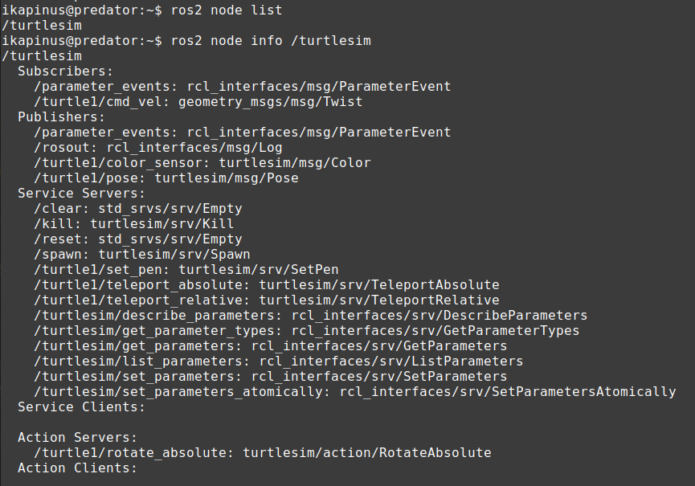

## Creating your Network Applications:

### 1) Demonstration: Relay in connected robotics (BUT)
This guide shows a simple offloading of the Turtlesim Teleop application to the remote computer. The Relay's full documentation can be found in its [repository](https://github.com/5G-ERA/relay_network_application)

First of all, let's try to install and run the Turtlesim:

```bash
sudo apt install ros-humble-turtlesim
ros2 run turtlesim turtlesim_node
```


The Turtle can be controlled by simple utility:

```bash
ros2 run turtlesim turtle_teleop_key
```

The current pose of the Turtle can be displayed using the ros2 topic utility:

```bash
ros2 topic echo /turtle1/pose
```


To offload the teleop part to the remote computer, we need to identify topics and services we need to mirror on the remote computer. We can use the ros2 node utility to show info of the selected node:

```bash
ros2 node info /turtlesim
```



From the list above, we can see that the turtlesim subscribes to the /turtle1/cmd_vel to move the Turtle around, and it publishes the /turtle1/poses topic with information about the current turtle position. Besides, we would like to provide the remote operator with the /reset service to reset the simulator to the start configuration. Therefore, on this side, we need to receive the /cmd_vel topic, send the /turtle1/poses topic to the remote side and make the service /reset available for the remote computer. We will install the relay_network_application for the purpose:

```bash
pip install era_5g_relay_network_application
pip install pymongo
```

The relay consists of a client and a server. The part with the turtles will run the server part, and the remote operator will use the client part. 

To configure the relay server, we need to set three env variables. The first describes the list of topics to be sent to the client; therefore, the /turtle1/pose. The configuration, in the simplest form, contains the name and type of the topic:

```bash
export TOPICS_TO_CLIENT='[{"name": "/turtle1/pose", "type": "turtlesim/msg/Pose"}]'
```

The second variable describes the list of the topics that will be obtained from the client (i.e., the command velocity topic): 

```bash
export TOPICS_FROM_CLIENT='[{"name": "/turtle1/cmd_vel", "type": "geometry_msgs/msg/Twist"}]'
```

The last variable specify the list of the services that will be mirrored to the client (/reset service):

```bash
export SERVICES_FROM_CLIENT='[{"name": "/reset", "type": "std_srvs/srv/Empty"}]'
```

Finally, we can run the server:

```bash
python -m era_5g_relay_network_application.server
```


The output of the relay server displays the server's address, which we will use to configure the client. 

Let's move to the remote computer, where we will deploy the teleop package and the relay client. We must install the turtlesim and the relay network application, just like on the original computer (see above).

We need to set another three env variables to specify the transport of the topics and services. They look the same as in the server configuration, but notice the change in the names:

```bash
export TOPICS_TO_SERVER='[{"name": "/turtle1/cmd_vel", "type": "geometry_msgs/msg/Twist"}]'
export TOPICS_FROM_SERVER='[{"name": "/turtle1/pose", "type": "turtlesim/msg/Pose"}]'
export SERVICES_TO_SERVER='[{"name": "reset", "type": "std_srvs/srv/Empty"}]'
```

Besides, we need to set the address of the server (obtained from the server output):

```bash
export NETAPP_ADDRESS=http://ADDRESS:PORT
```

And finally, run the client:

```bash
python -m era_5g_relay_network_application.client
```

We can now show the output of the /turtle1/pose topic and run the teleop node:

```bash
ros2 topic echo /turtle1/pose
ros2 run turtlesim turtle_teleop_key
```

The relay ensures the mirroring of the selected topics and services, so we can now control the turtle from the remote computer. If we want to reset the simulator, we can do it like this:

```bash
ros2 service call /reset std_srvs/srv/Empty
```

### 2) Demonstration: How to build a networked object detector in unstructured network (BUT)
### 3) Demonstration: How to build a tele-operation app in unstructured network (WINGS)
### 4) Demonstration: Onboarding and deploying the newly created network applications with orchestration (BED)
### 5) Hand on experience to the newly created ROS applications for connected robotics (Users, assisted by all)